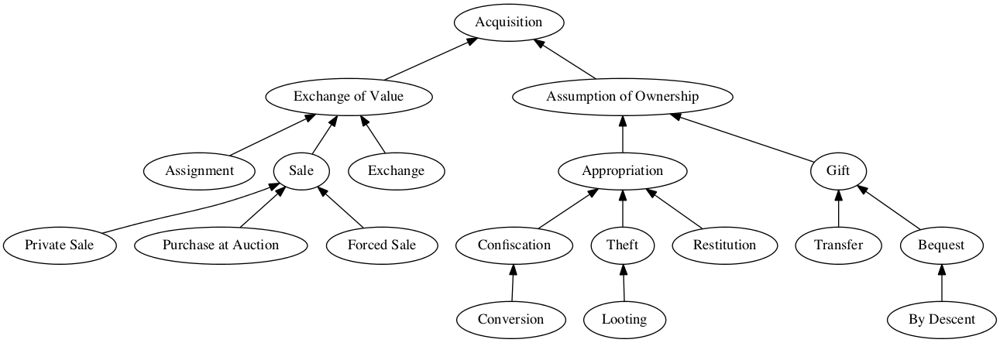
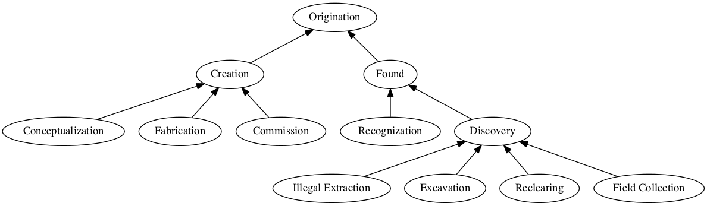
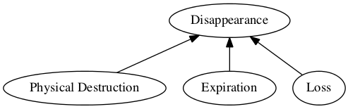
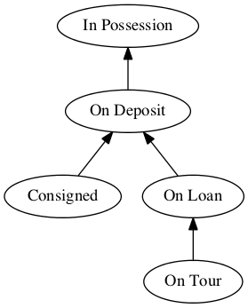
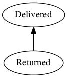

## Transfer of an Object

This category of events represents the transfer of ownership of an object 
from one party to another.  This includes transfers that involve the
exchange of value, such as purchases or exchanges.  This also includes 
transfers that do not involve the exchange of value, such as gifts or bequests.
This also includes transfers through illegal means, such as theft or looting.

By default, all events in a provenance record as assumed to be this type of
event.  

### Acquisition

**This object was acquired by the named party in an unknown fashion.**

*This is the default method for acquisitions and is the base type for all acquisitions.It should be used if there are no additional details available.  If there is not an explicit acquisition method mentioned, this will be assumed.*

**Preferred Form:**   
**Other Forms:**    by acquisition; acquired by  

**Example: **       Vincent Price [1911-1993], St. Louis, Missouri, July 1969.  

### Exchange of Value

**This object was obtained in some manner by the named party through an exchange of value.**

*This is the base class for all transfers where something of value was exchanged between the acquiring party and the receiving party.  This does not specify any details about the manner of the sale or the type of value exchanged.  In general, if it is assumed that money was exchanged, use 'purchased by'*

**Preferred Form:** through an exchange of value  

**Example: **       Vincent Price [1911-1993] through an exchange of value, St. Louis, Missouri, July 1969.  

### Assignment

**Ownership is assigned to the named party due to a previous agreement.**

**Preferred Form:** assigned to  

**Example: **       assigned to Vincent Price [1911-1993], St. Louis, Missouri, July 1969.  

### Sale

**This object was purchased by the named party.**

**Preferred Form:** purchased by  
**Other Forms:**    bought by; by purchase; purchased; sold to  

**Example: **       purchased by Vincent Price [1911-1993], St. Louis, Missouri, July 1969.  

### Private Sale

**This object was purchased by the named party from another party in a sale that was not publicly advertised and/or available.**

**Preferred Form:** privately purchased by  
**Other Forms:**    sold privately  

**Example: **       privately purchased by Vincent Price [1911-1993], St. Louis, Missouri, July 1969.  

### Purchase at Auction

**This object was purchased by the named party at auction.**

**Preferred Form:** purchased at auction by  
**Other Forms:**    by auction, to; by auction; sold at auction; sold at auction to; bought at sale by  

**Example: **       purchased at auction by Vincent Price [1911-1993], St. Louis, Missouri, July 1969.  

### Exchange

**This object was acquired by the named party, but something of value was exchanged for the object instead of money.**

**Preferred Form:** by exchange, to  
**Other Forms:**    by exchange; acquired by exchange  

**Example: **       by exchange, to Vincent Price [1911-1993], St. Louis, Missouri, July 1969.  

### Forced Sale

**This object was purchased by the named party using involuntary pressure on the seller.**

**Preferred Form:** forced sale, to  
**Other Forms:**    by forced sale  

**Example: **       forced sale, to Vincent Price [1911-1993], St. Louis, Missouri, July 1969.  

### Assumption of Ownership

**This object was acquired by the named party in some way that did not involve an exchange of value.**

**Preferred Form:** ownership assumed by  

**Example: **       ownership assumed by Vincent Price [1911-1993], St. Louis, Missouri, July 1969.  

### Appropriation

**This object was acquired by the named party without the consent of and without an exchange of value to the previous owner.**

**Preferred Form:** appropriated by  

**Example: **       appropriated by Vincent Price [1911-1993], St. Louis, Missouri, July 1969.  

### Confiscation

**This object was legally appropriated by an entity without the consent of the previous owner.**

**Preferred Form:** confiscated by  

**Example: **       confiscated by Vincent Price [1911-1993], St. Louis, Missouri, July 1969.  

### Theft

**This object was stolen by the named party.**

**Preferred Form:** stolen by  
**Other Forms:**    by theft; via theft  

**Example: **       stolen by Vincent Price [1911-1993], St. Louis, Missouri, July 1969.  

### Looting

**This object was looted during a conflict by the named party.**

**Preferred Form:** looted by  

**Example: **       looted by Vincent Price [1911-1993], St. Louis, Missouri, July 1969.  

### Restitution

**This object was returned to the named party after having previously been illegally taken from them.**

**Preferred Form:** restituted to  
**Other Forms:**    by restitution; via restitution  

**Example: **       restituted to Vincent Price [1911-1993], St. Louis, Missouri, July 1969.  

### Conversion

**This object was acquired by the named party through some form of eminent domain.**

**Preferred Form:** appropriated by  
**Other Forms:**    by appropriation; by conversion, to; by conversion  

**Example: **       appropriated by Vincent Price [1911-1993], St. Louis, Missouri, July 1969.  

### Gift

**This object was given to the named party.**

**Preferred Form:** gift to  
**Other Forms:**    gifted to; donated to; given to  

**Example: **       gift to Vincent Price [1911-1993], St. Louis, Missouri, July 1969.  

### Transfer

**This object was given to the named party from another part or element of the same named party.**

*This is typically used for objects transferring from one department to another within an organization.  It is NOT used for moments when an organization changes legal form;  see `by consolidation` for that.  This is also often used when an item is transferring from some form of partial ownership to being completely owned by one of the partial owners.*

**Preferred Form:** transferred to  
**Other Forms:**    by transfer  

**Example: **       transferred to Vincent Price [1911-1993], St. Louis, Missouri, July 1969.  

### Bequest

**This object was given to the named party through a will or other means following the death of the previous owner.**

**Preferred Form:** bequest, to  
**Other Forms:**    by bequest; bequeathed to  

**Example: **       bequest, to Vincent Price [1911-1993], St. Louis, Missouri, July 1969.  

### By Descent

**This object was given to the named party following the death of a previous owner who was their family member.**

*Note that this does not include the automatic transfer to a spouse following post WWII property law.   See 'via marriage' for those instances.*

**Preferred Form:** by descent to  
**Other Forms:**    by descent; by inheritance to; by inheritance  

**Example: **       by descent to Vincent Price [1911-1993], St. Louis, Missouri, July 1969.  

--------------------------------------------------------------------------------

## Origination of an Object.

This category of events describe the beginning of an object.  This may
represent the creation of an object or the moment in which the object began
to be perceived as an art object.  This relates to the specific physical or 
conceptual object being described; for instance, this could describe the a 
specific print of a photograph OR the conceptual entity of the photo, 
but should not be used to record both in a single provenance record.

All objects are assumed to have be originated. Origination MUST be the first
event in the provenance of an object.  If a record does not have an origination
event as the first event in the provenance, a generic origination event with
no date and an unknown party is assumed.

### Origination

**This object was brought into existence in some manner.**

*This is the most general form of origination.  It does not specify any particulars about the origination event, only that it existed and some party had agency in then origination.*

**Preferred Form:** gave origin by  

**Example: **       gave origin by Vincent Price [1911-1993], St. Louis, Missouri, July 1969.  

### Creation

**This object was created by the named party.**

**Preferred Form:** created by  

**Example: **       created by Vincent Price [1911-1993], St. Louis, Missouri, July 1969.  

### Found

**This object was found by the named party.**

**Preferred Form:** found by  
**Other Forms:**    discovered by  

**Example: **       found by Vincent Price [1911-1993], St. Louis, Missouri, July 1969.  

### Recognization

**This object was recognized as an artistic object by the named party.**

**Preferred Form:** recognized by  

**Example: **       recognized by Vincent Price [1911-1993], St. Louis, Missouri, July 1969.  

### Discovery

**This object was discovered by the named party as part of an archaeological event.**

**Preferred Form:** discovered by  

**Example: **       discovered by Vincent Price [1911-1993], St. Louis, Missouri, July 1969.  

### Illegal Extraction

**his object was extracted without legal permission by the named party as part of an archaeological event.**

**Preferred Form:** illegally extracted by  

**Example: **       illegally extracted by Vincent Price [1911-1993], St. Louis, Missouri, July 1969.  

### Excavation

**This object was uncovered by the named party as part of an archaeological event.**

**Preferred Form:** excavated by  

**Example: **       excavated by Vincent Price [1911-1993], St. Louis, Missouri, July 1969.  

### Reclearing

**This object was recleared by the named party as part of an archaeological event.**

*This indicates and object that had been prviously been excavated, by not removed at that time.*

**Preferred Form:** recleared by  

**Example: **       recleared by Vincent Price [1911-1993], St. Louis, Missouri, July 1969.  

### Field Collection

**This object was extracted by the named party as part of an archaeological event.**

**Preferred Form:** field collected by  
**Other Forms:**    by field collection; extracted by; by field collection  

**Example: **       field collected by Vincent Price [1911-1993], St. Louis, Missouri, July 1969.  

### Conceptualization

**This abstract object was conceived by the named party as an artistic object.**

**Preferred Form:** conceptualized by  

**Example: **       conceptualized by Vincent Price [1911-1993], St. Louis, Missouri, July 1969.  

### Fabrication

**A physical instance of a conceptual object was created by the named party.**

**Preferred Form:** fabricated by  
**Other Forms:**    published by; printed by  

**Example: **       fabricated by Vincent Price [1911-1993], St. Louis, Missouri, July 1969.  

### Commission

**This object was commissioned by the named party.**

*Note that this does not assume the named party received custody of the object. Typically, this would be followed by an agent who would be the fabricator, and then by a delivery of the object to the named party.*

**Preferred Form:** commissioned by  
**Other Forms:**    by commission; by commission, to; painted for; created for  

**Example: **       commissioned by Vincent Price [1911-1993], St. Louis, Missouri, July 1969.  

--------------------------------------------------------------------------------

## Disappearance of an Object.

This category of events indicates that the object being described no longer
exists to the best knowledge of the author.  Objects which have been 
destroyed fall into this category, as do objects which have been lost
permanently.  This can also be used to describe the completion of objects 
that are only intended to exist for a finite length of time.  

By default, objects have not disappeared.  If an object is believed to no 
longer exist, this SHOULD be recorded.

If recorded, this MUST be the final entry in a provenance record. There MUST
be at most one disappearance event for an object.

There MAY be an party recorded with these events.

### Disappearance

**This object was removed from existence in some manner.**

**Preferred Form:** disappeared by  

**Example: **       disappeared by Vincent Price [1911-1993], St. Louis, Missouri, July 1969.  

### Physical Destruction

**This object was permanently destroyed.**

**Preferred Form:** destroyed by  

**Example: **       destroyed by Vincent Price [1911-1993], St. Louis, Missouri, July 1969.  

### Expiration

**This object came to its intended temporal ending.**

**Preferred Form:** completed by  

**Example: **       completed by Vincent Price [1911-1993], St. Louis, Missouri, July 1969.  

### Loss

**This object has been lost and is not believed to be findable.**

**Preferred Form:** lost by  

**Example: **       lost by Vincent Price [1911-1993], St. Louis, Missouri, July 1969.  

--------------------------------------------------------------------------------

## Division of Custody & Ownership

This category of events describe moments where custody, but NOT ownership 
of an object is given to a party.  This is used for consignment, for loans,
and when one party is acting as a representative or agent for another.

### In Possession

**The named party has temporary custody, but not ownership of this object.**

*By default, ownership is assumed in this model.  This is used to explicitly indicate that the named party does NOT have ownership of the object.*

**Preferred Form:** in custody of  
**Other Forms:**    with  

**Example: **       in custody of Vincent Price [1911-1993], St. Louis, Missouri, July 1969.  

### On Deposit

**The named party has been given temporary custody without permission to sell or exhibit the object.**

*This differs from `on loan` chiefly when the temporary custody is done for the owner's benefit, not the temporary custodian's benefit.*

**Preferred Form:** on deposit to  
**Other Forms:**    on deposit; on deposit at  

**Example: **       on deposit to Vincent Price [1911-1993], St. Louis, Missouri, July 1969.  

### Consigned

**The named party has been given custody with the intent for them to sell the object.**

**Preferred Form:** consigned to  
**Other Forms:**    In sale at; sale; sold by; sold at; sale,  

**Example: **       consigned to Vincent Price [1911-1993], St. Louis, Missouri, July 1969.  

### On Loan

**The named party has been given temporary custody for use, but without permission to sell the object.**

**Preferred Form:** loaned to  
**Other Forms:**    on loan to; on permanent loan to; on long term at; on longterm loan at; on extended loan at  

**Example: **       loaned to Vincent Price [1911-1993], St. Louis, Missouri, July 1969.  

### On Tour

**The named party has been granted custody as part of a series of loans.**

**Preferred Form:** toured to  

**Example: **       toured to Vincent Price [1911-1993], St. Louis, Missouri, July 1969.  

--------------------------------------------------------------------------------

## Rejoining of Custody & Ownership

This category of events describe moments where the custody and ownership of
an object are reunited in a single party.  This implies that the party named 
in the immediately preceding event did not have ownership of the object, 
and thus MUST either follow a custody division event or a break in knowledge.

The party described is the receiving party, and they MUST already have 
been named as the owning entity.

### Delivered

**This object was delivered to the owning party by a party which had temporary custody.**

**Preferred Form:** delivered to  

**Example: **       delivered to Vincent Price [1911-1993], St. Louis, Missouri, July 1969.  

### Returned

**This object was returned to the owning party from a party which had temporary custody.**

**Preferred Form:** returned to  

**Example: **       returned to Vincent Price [1911-1993], St. Louis, Missouri, July 1969.  

--------------------------------------------------------------------------------

## Transformation of Party

This category of changes are used to handle instances in which an party
becomes another party through some sort of legal change.  This is explicitly
not for name changes; in that case the party remains the same party.  However,
this is used to record changes via marriages, corporate mergers, or widowhood.

### Party Transformation

**One legal party has transformed itself another legal party.**

**Preferred Form:** who became  

**Example: **       who became Vincent Price [1911-1993], St. Louis, Missouri, July 1969.  

### Marriage

**One individual has married another, and ownership is now shared.**

**Preferred Form:** via marriage  

**Example: **       Vincent Price [1911-1993] via marriage, St. Louis, Missouri, July 1969.  

### Widowhood

**One individual in a marriage has died, and ownership is assumed by the surviving party.**

**Preferred Form:** via widowhood  

**Example: **       Vincent Price [1911-1993] via widowhood, St. Louis, Missouri, July 1969.  

### Divorce

**A marriage has been legally dissolved, and ownership has been assumed by one of the married parties.**

**Preferred Form:** via divorce  

**Example: **       Vincent Price [1911-1993] via divorce, St. Louis, Missouri, July 1969.  

### Death

**This is used for the transfer to an estate from a party who has died.**

**Preferred Form:** via death  
**Other Forms:**    via his death; via her death; via their death  

**Example: **       Vincent Price [1911-1993] via death, St. Louis, Missouri, July 1969.  

### Partial Gift

**This is used for the transfer from one party to a legal entity that includes both themselves and another party.**

**Preferred Form:** via partial gift  
**Other Forms:**    partial gift to  

**Example: **       Vincent Price [1911-1993] via partial gift, St. Louis, Missouri, July 1969.  

### Organizational Consolidation

**One organization has joined with another organization, and the combined organization has assumed ownership.**

**Preferred Form:** via consolidation  

**Example: **       Vincent Price [1911-1993] via consolidation, St. Louis, Missouri, July 1969.  

--------------------------------------------------------------------------------
